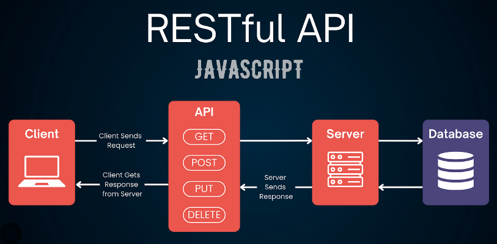
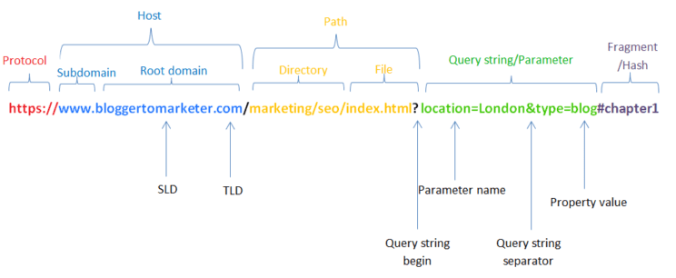
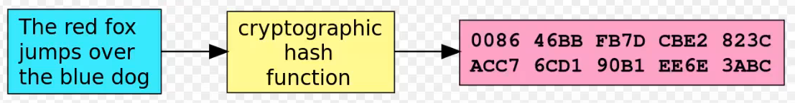
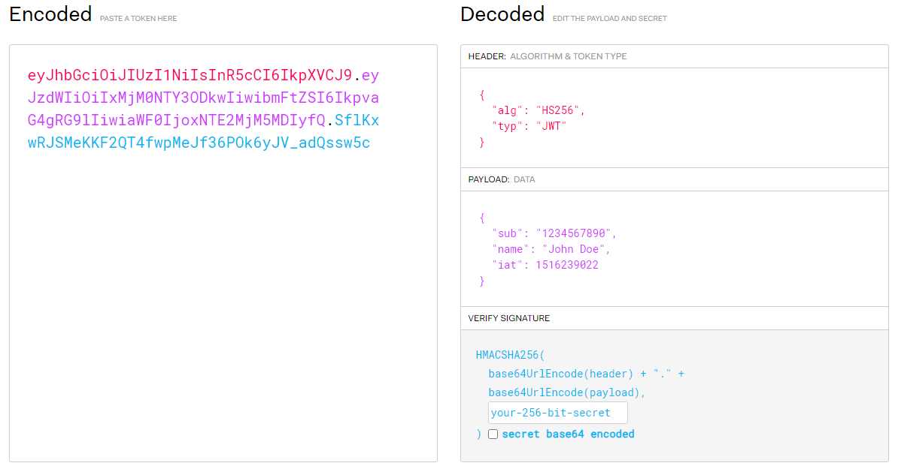

# Indice

🟢 COMPLETO
🟡 DA SISTEMARE
🟠 DA FINIRE
🔴 RIFARE

- [Intro](#Intro)
  - [Definizione API RESTful](#definizione-api-restful) 🟢
  - [Definizione URL e URI](#definizione-uri-e-url) 🟡
- [Express](#express)
  - [Cos'è Express?](#cosè-express) 🟢
  - [Inizializzazione progetto🔴](#middleware-di-errore-più-complesso-con-spunti-interessanti)
  - [Routing🔴](#cose-utili-per-il-routing)
  - [Tenere traccia delle rotte🟡](#tenere-traccia-delle-rotte)
  - [Middlewares](#middlewares)
  - [Pagination](#pagination)
  - [Multer e upload file](#importare-file-con-multer)
  - [CDN](#cdn-content-delivery-network)
  - [Cloudinary](#cloudinary)
  - [Autenticazione 🟠](#autenticazione)
- [MongoDB Atlas 🟠](#mongodb-atlas)
  - [Queries](#queries)
  - [Queries su MDB Compass](#utilizzo-queries-su-mongodb-compass)
  - [Selettori](#lista-dei-possibili-query-selectors)
- [Mongoose (con Express) 🟠](#mongoose-con-express)
  - [index.js](#collegarsi-al-db-tramite-mongoose-indexjs)
  - [Esempi CRUD 🟡](#esempi-crud)
  - [Schemi e modelli](#schemi-e-modelli)
  - [Embedding e referencing](#incosistenza-tra-dati-embedding-e-riferimenti)
  - [Variabili d'ambiente](#utilizzo-variabili-dambiente)
- [Altro 🟠](#altro)

# Intro

## Definizione API RESTful

Un'**API RESTful** è un'interfaccia di programmazione delle applicazioni che aderisce ai principi dell'architettura REST (Representational State Transfer). Questo tipo di API utilizza i metodi standard HTTP (GET, POST, PUT, DELETE...) per interagire con risorse rappresentate, di solito, in formati come JSON o XML. In una API RESTful, <u>ogni risorsa è identificata univocamente tramite URI</u> (Uniform Resource Identifiers) e le operazioni disponibili su queste risorse sono definite dai metodi HTTP. Queste API sono state progettate per essere stateless, il che significa che ogni richiesta HTTP deve contenere tutte le informazioni necessarie per comprenderla, senza richiedere che il server memorizzi dati o stati della sessione dell'utente.



## Definizione URI e URL

In informatica, lo Uniform Resource Identifier (in acronimo `URI`) <u>è una sequenza di caratteri che identifica universalmente ed univocamente una risorsa</u>. Sono esempi di URI: un indirizzo web (URL), un documento, un indirizzo di posta elettronica, il codice ISBN di un libro, un numero di telefono col prefisso internazionale.

Un Uniform Resource Locator, noto con l'acronimo `URL` (lett. "localizzatore uniforme di risorse"), <u>è una sequenza di caratteri che identifica univocamente l'indirizzo di una risorsa su una rete di computer</u>, come ad esempio un documento, un'immagine, un video, tipicamente presente su un host server e resa accessibile a un client. Un esempio di URL (caso specifico di URI):

`https://www.example.com/articles/2023/03/15/my-article`

In questo esempio:

- `https://` è lo schema, che specifica il **protocollo** da utilizzare per accedere alla risorsa.
- `www.example.com` è il nome del **dominio**, che indica il server dove la risorsa è ospitata.
- `/articles/2023/03/15/my-article` è il **path**, che specifica il percorso preciso della risorsa sul server.

Questo URL/URI **identifica univocamente una risorsa**, in questo caso, un articolo specifico su un sito web.

L'immagine sottostante definisce meglio alcune parti dell'URL che vedremo più avanti:



# Express

## Cos'è Express?

Express, è un **framework** per applicazioni web per Node.js. È progettato per costruire applicazioni web e API. Le sue funzionalità principali sono:

- semplificare il processo di configurazione e gestione di un server web in Node.js
- permette di definire le route (percorsi) dell'applicazione con metodi HTTP diversi (come GET, POST, PUT, DELETE) e di gestire le richieste e risposte HTTP. Questo rende Express molto utile per lo sviluppo di API RESTful.
- offrire un sistema di [middleware](#middlewares), che consente agli sviluppatori di inserire logica a livelli diversi della richiesta HTTP. Un middleware può essere utilizzato per eseguire codice, apportare modifiche alle richieste e alle risposte, terminare il ciclo richiesta-risposta o chiamare il prossimo middleware nella pila.
- fornire un robusto meccanismo di gestione degli errori. È possibile definire middleware specifici per la gestione degli errori che catturano e gestiscono eccezioni o errori HTTP.

## Inizializzare un nuovo progetto back-end

- creiamo una nuova cartella
- lanciamo `npm init`
- rispondiamo alle domande che vengono poste dal wizard (o `npm init -y` per evitare le domande)
- installiamo express con `npm install express`
- ci assicuriamo che il nostro `.gitignore` includa `node_modules`
- creiamo una directory `src` dentro la quale inseriamo il nostro `index.js` (questa è una convenzione, dettata dal fatto che se in un secondo momento aggiungessimo una fase di build, è comodo avere tutti i nostri file dentro una sola cartella)
- infine, creiamo uno script che ci permette di lanciare il nostro server, generalmente lo script si chiama `dev` o `start`

  - installiamo come dipendenza di sviluppo `nodemon` che ci consente di rilanciare lo script del server ad ogni salvataggio
  - dentro il nostro `package.json`:
    - `"dev": "nodemon src/index.js"`

- prima di lanciare il server ricorda di aggiungere al package.json `"type" : "module"`
- lanciamo il nostro server:

```js
server.listen(port, () => {
  console.log("Server listening at port: ", port);
});
```

## COSE UTILI PER IL ROUTING:

Questo comando analizza automaticamente i corpi delle richieste in arrivo nel formato JSON:

```js const apiRouter = express.Router();
apiRouter.use(express.json());
```

Questo è un esempio di richiesta GET all'URL .../api/ che manda al client del codice html:

```js
apiRouter.get("/", (req, res) => {
  res.status(200).send(/*html*/ `
    <!doctype html>
  <html lang="en">
    <head>
      <meta charset="utf-8">
      <meta name="viewport" content="width=device-width, initial-scale=1">
      <title>Bootstrap demo</title>
      <link href="https://cdn.jsdelivr.net/npm/bootstrap@5.3.2/dist/css/bootstrap.min.css" rel="stylesheet" integrity="sha384-T3c6CoIi6uLrA9TneNEoa7RxnatzjcDSCmG1MXxSR1GAsXEV/Dwwykc2MPK8M2HN" crossorigin="anonymous">
    </head>
    <body>
      <h2 style="color: red">Il get all'indirizzo .../api/ sta funzionando corretamente</h2>
      <script src="https://cdn.jsdelivr.net/npm/bootstrap@5.3.2/dist/js/bootstrap.bundle.min.js" integrity="sha384-C6RzsynM9kWDrMNeT87bh95OGNyZPhcTNXj1NW7RuBCsyN/o0jlpcV8Qyq46cDfL" crossorigin="anonymous"></script>
    </body>
  </html>
    `);
});

export default apiRouter;
```

Un altro esempio di risposta ad una richiesta GET:

- Quando viene effettuata una richiesta GET all'URL '/api/test', il server risponderà con un oggetto JSON contenente il messaggio specificato:

```JS
apiRouter.get("/test", (req, res) => {
  res.json({ message: "Hello, world!" });
});
```

Un esempio di richiesta POST:

- In questo caso, la funzione di gestione stampa sul server `console.log` il corpo della richiesta `req.body`, che contiene i dati inviati nel corpo della richiesta POST. Dopo aver stampato il corpo della richiesta, il server risponderà con uno stato HTTP 200 (OK) utilizzando res.status(200).send(). Questo indica che la richiesta è stata gestita correttamente.

```js
apiRouter.post("/body", (req, res) => {
  console.log(req.body);

  res.status(200).send();
});
```

La stringa `server.use("/api", apiRouter);` è una dichiarazione in Express.js che indica l'utilizzo di un router specifico (apiRouter) per gestire tutte le richieste dirette alle rotte che iniziano con '/api'. In altre parole, quando una richiesta arriva all'URL che inizia con '/api', Express instradereà la gestione di quella richiesta al router apiRouter.

Inoltre è importante ricordarsi di importare i vari router:

```js
import apiRouter from "./apiRouter.js";
```

## TENERE TRACCIA DELLE ROTTE

Per tenere traccia delle varie rotte è possibile installare `npm install express-list-endpoints`. Una volta importato come `import list from "express-list-endpoints"` è possibile fare ciò che segue:

```js
mongoose
  .connect(process.env.MONGO_URL)
  .then(() => {
    server.listen(port, () => {
      console.log("🍇 Server listening to port:", port);
      console.log(list(server)); //questo è il passaggio fondamentale
    });
  })
  .catch(() => {
    console.log("Errore nella connessione al DB", process.env.MONGO_URL);
  });
```

Così facendo a terminale si avrà la lista di tutte le rotte definite in Express, e verranno mostrate informazioni come i percorsi delle rotte e i metodi HTTP associati. Dal terminale:

```bash
 Server listening to port: 3030
[
  {
    path: '/api/users/test',
    methods: [ 'GET' ],
    middlewares: [ 'anonymous' ]
  }
]
```

## MIDDLEWARES

In Express, un middleware è una funzione che ha accesso agli oggetti di richiesta (request), risposta (response), e al successivo middleware nella catena delle richieste. Esso può eseguire operazioni su tali oggetti, modificare la richiesta e la risposta, o terminare la catena delle richieste. I middleware sono utilizzati per aggiungere funzionalità, gestire richieste e risposte, nonché per eseguire azioni specifiche durante il ciclo di vita di una richiesta HTTP.

### Esempio middleware di autenticazione:

```js
//FILE checkAuth.js (dove definisco il middleware)
import dotenv from "dotenv";
dotenv.config();

export const checkAuth = (req, res, next) => {
  //per passare questo mdw devo avere tra gli header l'authorization
  if (req.headers.authorization === process.env.PSSW) {
    next(); //serve per passare al middleware successivo
  } else {
    res.status(401).json({ error: "password sbagliata" });
  }
};

//FILE userRouter.js (dove applico il middleware)
import express from "express";
import { User } from "../models/users.js";
import mongoose from "mongoose";
import { checkAuth } from "../middlewares/checkAuth.js";

const userRouter = express.Router();

userRouter.use(express.json());
userRouter.use(checkAuth);
//tutte le richieste sotto questa riga dovranno avere nell'header l'Authorization
```

Il codice qui sopra definisce un MIDDLEWARE DI AUTENTICAZIONE chiamato checkAuth che verifica se l'header "Authorization" nella richiesta contiene una password corrispondente a quella definita nel file di configurazione .env. Se tutto è apposto la funzione next() fa si che si passi al prossimo middleware, in caso contrario viene restituito 401 Unauthorized.

Interessante è il fatto che posso applicare il middleware (o più!) direttamente ad una richiesta specifica oltre che ad un'intera ruote:

```js
userRouter.get("/", checkAuth, checkAuth2, checkAuth3 async (req, res, next) => {
  //CODICE
});
```

### Esempio middleware di errore:

```js
//FILE genericError.js
export const genericError = (err, req, res, next) => {
  console.log(err);

  res.status(err.statusCode || 500).send(err.message);
};

//FILE index.js
import express from "express";
import mongoose from "mongoose";
import dotenv from "dotenv";
import list from "express-list-endpoints";
import apiRouter from "./Routes/apiRouter.js";
import { genericError } from "./middlewares/genericError.js";

dotenv.config();

const server = express();
const port = 3030;

server.use("/api", apiRouter);
server.use(genericError);
```

Il middleware di errore genericError.js è una funzione che gestisce gli errori durante l'esecuzione dell'applicazione Express. Riceve quattro parametri: err (l'errore), req (la richiesta), res (la risposta), e next (funzione per passare al middleware successivo).

La funzione logga l'errore sulla console, imposta lo stato della risposta in base al codice di stato dell'errore o a 500, e invia il messaggio di errore come risposta.

Nel file principale index.js, il middleware di errore è applicato con server.use(genericError);. Questo assicura che gestisca gli errori in tutta l'applicazione, intervenendo se nessun altro middleware o route li gestisce precedentemente.

Quando si verifica un errore in un middleware o in una route di Express, può essere passato al successivo utilizzando `next(errore)`. `Express cerca automaticamente il primo middleware con quattro parametri` (errore, richiesta, risposta, prossimo) e lo esegue, fungendo da gestore globale di errori. È importante posizionare questo middleware alla fine della catena dei middleware per garantire una gestione uniforme degli errori in tutta l'applicazione.

È una pratica comune avere una catena di middleware prima del middleware di errore per eseguire operazioni specifiche della richiesta, e il middleware di errore viene utilizzato per gestire errori imprevisti durante queste operazioni

### Try and catch e next(error)

#### Qual è la differenza tra queste due porzioni di codice?

```js
// Esempio userRouter.post
userRouter.post("/", async (req, res, next) => {
  try {
    const newUser = new User(req.body);
    await newUser.save();
    res.status(201).json(newUser);
  } catch (error) {
    error.statusCode = 400;
    next(error);
  }
});

// Esempio userRouter.put
userRouter.put("/:id", async (req, res, next) => {
  try {
    const updatedUser = await User.findByIdAndUpdate(req.params.id, req.body, {
      new: true,
    });
    res.json(updatedUser);
  } catch (error) {
    next(error);
  }
});
```

- Prima di rispondere supponiamo che il gestore di errori sia il seguente:

```js
//GESTORE DI ERRORI
export const genericError = (err, req, res, next) => {
  console.log(err);

  res.status(err.statusCode || 500).send(err.message);
};
```

- La prima porzione di codice, in caso di errore, imposta `error.statusCode = 400`. Successivamente grazie alla chiamata di next(err), l'errore viene passato al primo middleware di gestione di errore che trova (ovvero il primo ad avare quattro parametri). Dato che `error.statusCode` è stato settato, il gestore di errori restituirà lo stato 400. Ricordo che la riga `err.statusCode || 500` restituisce il valore di `err.statusCode` se tale valore è truthy (diverso da zero, null, undefined, false, o una stringa vuota), altrimenti restituisce 500.

- La seconda porzione di codice non attribuisce un valore ad `error.statusCode`, il quale di fatto rimarrà undefinded. Come nel caso precedende l'errore viene comunque inoltrato al primo middleware di gestione di errori. Tuttavia dato che lo statusCode non è definito, verrà restituito il codice di errore generico 500.

### Middleware di errore più complesso con spunti interessanti

```js
// File: errorMiddleware.js
export const errorMiddleware = (err, req, res, next) => {
  let statusCode = err.statusCode || 500;
  let message = err.message || "Errore interno del server😒";

  if (err.name === "ValidationError") {
    // Gestione degli errori di validazione del modello Mongoose
    statusCode = 400;
    message = "Errore di validazione";
  }

  if (err.name === "UnauthorizedError") {
    // Gestione degli errori di autenticazione JWT
    statusCode = 401;
    message = "Non autorizzato";
  }

  if (err.name === "CustomError") {
    // Gestione di un errore personalizzato con un codice di stato specifico
    statusCode = err.statusCode || 500;
    message = err.message || "Errore personalizzato";
  }

  // Log dell'errore (puoi implementare il tuo sistema di logging)
  console.error(err);

  // Risposta al client con il codice di stato e il messaggio appropriati
  res.status(statusCode).json({ error: message });
};
```

- In questo esempio il middleware accetta un errore (err) insieme a req, res, e next.
- Imposta un codice di stato e un messaggio predefiniti, ma li modifica se l'errore specifico ha informazioni più dettagliate.
- Gestisce errori specifici come quelli di validazione Mongoose, errori di autenticazione JWT e un errore personalizzato chiamato 'CustomError'.
- Logga l'errore per eventuali azioni di troubleshooting o logging personalizzate.
- Invia una risposta JSON al client con il codice di stato e il messaggio appropriati.

## Pagination

### Limit e skip

Per ottimizzare le richieste o per scopi di struttura, è possibile includere specifiche query nell'URL per cercare solo determinati prodotti e iniziare dalla posizione desiderata nel database. Ad esempio, con l'URL `http://localhost:3030/api/products/?limit=10&skip=2`, una richiesta GET restituirà dieci prodotti a partire dal terzo elemento nel database. Nel codice Express fornito, le variabili limit e skip vengono estratte dalla query dell'URL e utilizzate per limitare il numero di risultati restituiti e specificare da quale punto iniziare nella raccolta di dati.

```js
//Esempio sort, limit, skip
.get("/", async (req, res, next) => {
    try {
      const { limit, skip } = req.query;
      const products = await Product.find({})
      .sort({price: "ascending"});
      .limit(limit)
      .skip(skip)
      //restituisce 10 elementi a partire dal terzo, ordinati per prezzo crescente
      res.json(products);
    } catch (err) {
      next(err);
    }
  })
```

### Sort

Utilizzando l'URL `http://localhost:3030/api/products/?limit=10&skip=2`, la richiesta otterrà 10 oggetti dal database, ordinati dal prezzo più basso al più alto. È importante notare che <u>l'ordinamento non si applica solo ai primi 10 elementi del database, ma coinvolge l'intero set di dati</u> corrispondente alla query. In altre parole, il database esegue prima l'ordinamento completo e successivamente restituisce i 10 elementi richiesti, a partire dal terzo oggetto in base all'ordinamento effettuato.

### Esempio con ricerca per chiave generica

```js
//Altro esempio sort, limit, skip con chiave dinamica
.get("/", async (req, res, next) => {
    try {
        const { limit, skip, sortBy, order } = req.query;
        const products = await Product.find({})
            .sort({ [sortBy]: order })
            .limit(limit)
            .skip(skip);
        // Le parentesi quadre indicano che sortBy è una chiave dinamica!
        // Restituisce un numero specifico di elementi a partire da una posizione specifica, ordinati in base alle specifiche richieste.
        res.json(products);
    } catch (err) {
        next(err);
    }
});

```

Questo codice utilizza i parametri `sortBy` e `order` dalla query per consentire un ordinamento flessibile dei risultati di ricerca. Ad esempio, è possibile ordinare i prodotti per prezzo, nome o qualsiasi altro campo specificato dinamicamente. Nel codice precedente invece, l'ordinamento è fisso sul campo "price" in ordine crescente, senza la possibilità di variare il campo di ordinamento o l'ordine risultante. Un ipotetico URL per sfruttare appieno il codice può essere: `http://localhost:3030/api/products/?limit=10&sortBy=price&order=ascending`

## Importare file con multer

Multer è una libreria middleware per Node.js che facilita il caricamento di file in applicazioni web. È ampiamente utilizzata con il framework Express per gestire i dati di tipo multipart/form-data, che è il formato utilizzato per caricare file da un form HTML.

```js
//pnpm multer
import multer from "multer";

const storage = multer.diskStorage({
  destination: "./uploads",
  filename: function (req, file, callback) {
    if (["image/jpeg", "image/png"].includes(file.mimetype)) {
      callback(null, `${Date.now()}_${file.originalname}`);
    } else {
      const error = new Error("Please upload png or jpg");
      error.statusCode = 500;
      callback(error);
    }
  },
});

const upload = multer({ storage });

apiRouter.patch("/multipart", upload.single("avatar"), (req, res, next) => {
  console.log(req.file.path); // stampa il percorso dove viene salvato il file
  res.send(); // qui uso il mio middleware per caricare l'immagine,il mio endpoint riceverà un solo file.
});

//il codice sotto serve a recuperare i file nel server tramite il loro percorso MA useremo cloudinary
// apiRouter.get("/download/:filename"),
//   (req, res, next) => {
//     res.send(path.resolve("./src/uploads/" + req.params.filename));
//   };
```

Questo codice configura multer per caricare file, limitando i tipi di file a JPEG e PNG e salvandoli in una cartella uploads con nomi di file univoci. Gestisce anche gli errori relativi al tipo di file, restituendo un errore se viene caricato un tipo di file non consono.

Analizziamo meglio il codice:

1. `multer.diskStorage()` serve a memorizzare i file caricati sul disco.
2. `destination: "./uploads"` specifica la directory in cui i file caricati saranno salvati. In questo caso, i file verranno salvati nella cartella uploads nella directory radice del mio progetto.
3. `filename: function (req, file, callback) { ... }` cambia il nome del file salvato se l'estensione corrisponde a quella desiderata, se no da errore.
4. `callback(null, '${Date.now()}_${file.originalname}')` cambia il nome del file salvato e ritorna una cosa del genere: `"1630000000000_foto.png"` dove il numero davanti al nome è dato dalla funzione `Date.now()`
5. `if (["image/jpeg", "image/png"].includes(file.mimetype))` controlla se il file caricato è il formato giusto se no da errore
6. `const upload = multer({ storage })` così facendo viene creato il middleware

## CDN (content delivery network)

Un CDN, o Content Delivery Network, è una rete di server distribuiti geograficamente progettata per fornire contenuti web, come immagini, video e pagine HTML, agli utenti in modo più rapido ed efficiente. Quando un utente accede a un sito web, il CDN reindirizza la richiesta al server più vicino geograficamente, riducendo il tempo di caricamento del sito e migliorando l'esperienza dell'utente. Questo è particolarmente utile per siti con traffico elevato o con una base di utenti globale, poiché aiuta a gestire grandi volumi di traffico e riduce il rischio di congestione della rete.

## Cloudinary

Cloudinary è un servizio cloud che fornisce strumenti per caricare, memorizzare, manipolare e distribuire contenuti multimediali come immagini e video. Offre una piattaforma versatile per organizzare e ottimizzare media per web e applicazioni mobili, migliorando le prestazioni e riducendo l'uso della larghezza di banda. Utilizzando funzioni di editing avanzate e una rete di distribuzione dei contenuti (CDN), Cloudinary accelera il caricamento dei media e migliora l'esperienza dell'utente finale, rendendolo ideale per gestire grandi volumi di risorse multimediali in modo efficiente.

### Come implementare cloudinary nel nostro progetto

1. in console: `npm install cloudinary`
2. in console: `npm multer-storage-cloudinary`
3. recuperare CLOUDINARY_URL dalla dashboard di cloudinary e creare nuova variabile d'ambiente
4. il codice diventa:

```js
import multer from "multer";
import { CloudinaryStorage } from "multer-storage-cloudinary";
import { v2 as cloudinary } from "cloudinary"; //ultima versione di cloudinary, 'as' cambia il nome di v2

const cloudinaryStorage = new CloudinaryStorage({
  cloudinary,
  params: {
    folder: "folder-name",
  },
});

const upload = multer({ storage: cloudinaryStorage });

apiRouter.patch("/multipart", upload.single("avatar"), (req, res, next) => {
  console.log(req.file.path);
  res.send();
});
```

- login: yivegoj751@mcenb.com
- pssw: Epic0de!

## Inviare un' email con Resend

...

## Autenticazione

### Funzione di hashing

Una funzione di hashing prende come input una password, un file, un testo etc. e restituisce un output chiamato digest o hash. Le caratteristiche principali di questa funzione sono:

1. Trasformazione Unidirezionale: quando inserisco un input nella funzione di hashing, ottengo un output. Questo processo è unidirezionale ovvero non è possibile tornare dall'hash all'input originale.
2. Output di lunghezza fissa: non importa quanto sia lungo o breve l'input, l'hash avrà sempre la stessa lunghezza. Questo aiuta a mantenere la consistenza e la sicurezza.
3. Unicità: idealmente, ogni input diverso dovrebbe produrre un hash diverso. Se due input diversi producono lo stesso hash (un evento chiamato "collisione"), ciò può essere un problema di sicurezza.
4. Velocità di calcolo: le funzioni di hashing sono progettate per essere molto veloci nel calcolare l'hash di un input.
5. Irreversibilità: è computazionalmente impraticabile determinare l'input originale basandosi solo sull'hash. Questo è diverso dalla crittografia, dove l'obiettivo è poter decifrare i dati.




### bCrypt

bCrypt è un algoritmo di hashing per password che implementa un meccanismo di "salting" e di "key stretching" per migliorare la sicurezza delle password memorizzate. Ecco come funziona:

- Salting: il "salt" è una stringa di dati casuali che viene aggiunta alla password prima di eseguire l'hash. Questo aiuta a proteggere contro attacchi di tipo "rainbow table", dove gli aggressori utilizzano tabelle precalcolate di hash per decifrare password comuni. Ogni password ottiene un salt unico, il che significa che anche se due utenti hanno la stessa password, i loro hash saranno diversi a causa dei diversi salt.

- Hashing Multiplo: bCrypt esegue l'hashing della password (con il salt aggiunto) molte volte (o "rounds"). Questo processo di "key stretching" rende l'hashing più lento, il che è un vantaggio dal punto di vista della sicurezza. Rende molto più difficile per un attaccante eseguire attacchi di forza bruta, poiché ogni tentativo di indovinare la password richiede più tempo.

### Come utilizzare bCrypt nel nostro progetto

- `npm install bcrypt` e dopo aver importato il pacchetto:

```js
//Questo codice si occupa della registrazione di un utente
// e dell'hashing della password fornita
usersRouter.post("/", async (req, res) => {
  const password = await bcrypt.hash(req.body.password, 10);

  const newUser = await User.create({
    ...req.body,
    password,
  });

  const { password: _, __v, ...newUserWithoutPassword } = newUser.toObject();
  res.status(201).json(newUserWithoutPassword);
});
```

- Utilizzando la libreria bcrypt, la password fornita dall'utente nel corpo della richiesta (req.body.password) viene hashata. Il valore 10 indica il "cost factor", ovvero il numero di iterazioni dell'algoritmo di hashing. Successivamente, si procede alla creazione di un nuovo documento utente con User.create di Mongoose, includendo nella creazione l'oggetto utente completo (...req.body) con la password hashata.

- Per motivi di sicurezza, prima di inviare la risposta al client, la password hashata viene rimossa dall'oggetto utente. Questo passaggio è fondamentale per evitare l'esposizione di dati sensibili, anche se sotto forma di hash. La rimozione avviene attraverso la destrutturazione dell'oggetto, estraendo la password e **v (campo interno di Mongoose) e creando un nuovo oggetto, newUserWithoutPassword, che contiene tutte le proprietà dell'utente eccetto la password e **v.

- E' importante notare che la password in `req.body` è in formato non hashato, mentre la variabile password contiene la versione hashata della stessa. Quindi, con `...req.body`, tutti i campi del body della richiesta, inclusa la password originale, vengono copiati. Poi, con password, `la password non hashata viene sovrascritta dalla versione hashata` per garantire la sicurezza nel salvataggio nel database.

- Concentriamoci su questo comando:

```js
const { password: _, __v, ...newUserWithoutPassword } = newUser.toObject();
```

Questo comando utilizza la destrutturazione degli oggetti in JavaScript per ottenere alcune proprietà specifiche dell'oggetto newUser (che è un documento Mongoose). Il metodo toObject() converte il documento Mongoose in un oggetto JavaScript puro.`password: _` prende il campo password dall'oggetto e lo assegna a una variabile chiamata `_`. Questo è un modo comune per indicare che <u>la variabile non verrà utilizzata</u>. In sostanza, stiamo estraendo la password ma poi la ignoriamo.
`__v` è un campo interno utilizzato da Mongoose per la gestione della versione del documento. Anche questo viene estratto e ignorato.
`...newUserWithoutPassword` raccoglie tutte le restanti proprietà di newUser (esclusi password e \_\_v) in un nuovo oggetto chiamato newUserWithoutPassword. Oggetto che viene infine resituito al client se tutto è andato a buon fine.

### JWT definizione

JWT, acronimo di JSON Web Token, è uno standard aperto (RFC 7519) per la creazione di token di accesso che permettono la trasmissione sicura di informazioni tra due parti, tipicamente un server e un client.

Un token JWT è composto da tre parti separate da punti: l'intestazione (header), il carico utile (payload) e la firma (signature).



1. L'intestazione (in rosso) contiene informazioni sul tipo di token (JWT) e l'algoritmo di crittografia utilizzato.
2. Il payload (in viola) include le affermazioni (claims), ovvero le informazioni specifiche dell'utente o altre informazioni necessarie.
3. La firma (in blu) è usata per verificare che il messaggio non sia stato modificato lungo il percorso. Viene calcolata utilizzando l'intestazione, il carico utile e <u>una chiave segreta che solo l'emittente del token conosce.</u>

### Come utilizzare JWT (creare e dare al client il token)

- `npm install jsonwebtoken` e dopo aver importato il pacchetto:

```js
//questo codice si occupa del CONTROLLO delle credenziali di un utente registrato
//e della creazione di un token JWT se tutto è andato a buon fine.
usersRouter.post("/session", async (req, res) => {
  const { email, password } = req.body;
  const user = await User.findOne({ email });

  if (!user) {
    return res.status(404).json({ message: "User not found" });
  }

  const isPasswordCorrect = await bcrypt.compare(password, user.password);

  if (!isPasswordCorrect) {
    return res.status(401).json({ message: "Invalid credentials" });
  }

  const payload = { id: user._id };

  const token = jwt.sign(payload, process.env.JWT_SECRET, { expiresIn: "1h" });

  res.status(200).json({ userId: user._id, token });
});
```

Descrizione del codice sopra:

- il metodo post sul router usersRouter crea un endpoint denominato /session per gestire le richieste di login
- dalla richiesta (req.body), vengono estratte l'email e la password fornite dall'utente
- utilizzando Mongoose, il sistema cerca nel database un utente che corrisponde all'email fornita. Se non trova nessun utente, restituisce un errore 404 (utente non trovato)
- se un utente con l'email fornita viene trovato, il sistema verifica se la password fornita corrisponde alla password hashata salvata nel database usando bcrypt.compare
- se l'autenticazione ha successo, viene creato un payload per il JWT. Questo payload contiene l'ID dell'utente (estratto dall'oggetto user)
- utilizzando il pacchetto jsonwebtoken, viene generato un token JWT firmandolo con una chiave segreta (process.env.JWT_SECRET) e impostando un tempo di scadenza (expiresIn: "1h")
- infine, il token JWT insieme all'ID dell'utente viene inviato al client con una risposta HTTP 200, indicando un processo di autenticazione riuscito

#### NB: Una volta ottenuto il token JWT, ci sono alcuni passaggi tipici che sia il client che l'applicazione seguono:

1. l'utente (o meglio, il client dell'utente, come un browser web) <u>salva il token JWT</u>. Il Token può essere salvato nel localStorage, un cookie, o la sessione del browser
2. per ogni richiesta successiva al server che richiede autenticazione, <u>il client include il token JWT</u>, solitamente nell'intestazione della richiesta HTTP (spesso come parte dell'intestazione 'Authorization' con il prefisso 'Bearer'). Questo serve a dimostrare che l'utente ha già effettuato l'accesso e ha i permessi necessari per accedere a risorse protette.
3. ogni volta che il server riceve una richiesta che richiede autenticazione, esamina l'intestazione della richiesta per verificare la presenza del token JWT. Se il token è presente, il server lo valida. Questo significa che verifica la firma del token per assicurarsi che non sia stato manomesso e controlla anche altri aspetti, come la scadenza del token.
4. se il token è valido, l'utente viene considerato autenticato e può accedere alle risorse richieste.

Vediamo queste cose in dettaglio:

### Come utilizzare JWT (controllo del Token tramite middleware)

Una volta fornito il token JWT all'utente, è essenziale avere un meccanismo che, ad ogni richiesta al server, controlli la validità del token. Questo viene realizzato tramite il seguente middleware:

```js
//FILE: jwt_middleware.js
//Questo middleware controlla la validità del token
import jwt from "jsonwebtoken";
import { User } from "../models/users.js";

const checkJwt = async (req, res, next) => {
  try {
    const token = req.headers.authorization.split(" ")[1];
    const payload = jwt.verify(token, process.env.JWT_SECRET);

    req.user = await User.findById(payload.id).select("-password");

    if (!req.user) {
      return res.status(404).json({ message: "User not found" });
    }

    next();
  } catch (error) {
    return res.status(401).json({ message: "Invalid token" });
  }
};

export default checkJwt;

//FILE UserRouter, applichiamo il middleware appena creato
usersRouter.get("/:id", checkJwt, async (req, res) => {
  res.status(200).json(req.user);
});
```

Descrizione del codice:

- `const token = req.headers.authorization.split(" ")[1]` estrae il token JWT dall'intestazione 'Authorization' della richiesta, assumendo che il token sia preceduto da una parola (solitamente 'Bearer') seguita da uno spazio
- `const payload = jwt.verify(token, process.env.JWT_SECRET)` utilizza jsonwebtoken per verificare la validità del token utilizzando la chiave segreta (JWT_SECRET). Se il token è valido, estrae il payload
- `req.user = await User.findById(payload.id).select("-password")` cerca nel database un utente con l'ID specificato nel payload del token. Esclude la password dal risultato
- `next()`: se l'utente è stato trovato e il token è valido, chiama next() per procedere al prossimo middleware nella catena di Express
- La parte finale del codice applica il middleware checkJwt a una richiesta GET. Se l'utente fornisce un token valido superando il controllo di checkJwt, la richiesta procede senza problemi.

**Domanda**: come mai si aggiungono le informazioni dell'utente a `req.user` (levando di mezzo la password)?

**Risposta**: perchè quando un utente effettua una richiesta al server e viene autenticato tramite un token JWT, è utile avere un modo rapido e conveniente per accedere alle informazioni di quell'utente in seguito nella catena di middleware o nei controller. Impostando req.user, si aggiungono questi dettagli all'oggetto della richiesta (req), rendendoli facilmente accessibili in qualsiasi punto successivo del ciclo di vita della richiesta.

### OAuth

### Come implementare OAuth nel nostro progetto

# MongoDB Atlas

- creazione di un'utenza
- creazione di un cluster
- creazione di un DB
- creazione di una o piu collezioni
- creazione di multipli documenti

## Queries

Le queries in MongoDB sono come istruzioni specializzate che usiamo per comunicare con il database. Attraverso queste istruzioni, possiamo eseguire operazioni di lettura, scrittura e manipolazione dei dati. Le queries ci permettono di cercare informazioni specifiche, aggiornare o inserire nuovi dati nel database secondo criteri definiti. Inoltre, offrono opzioni per ordinare i risultati, limitare la quantità di dati restituiti e proiettare solo le informazioni necessarie.

### Esempi queries:

Non dare troppo caso a ciò che viene prima di find.

### 1. Lettura di tutti i documenti

```js
db.collection("nomi").find({});
```

### 2. Filtraggio in base ad un criterio ($gt greater than)

```js
db.collection("prodotti").find({ prezzo: { $gt: 100 } });
```

### 3. Visualizzare solo alcuni campi (chiave valore)

```js
db.collection("utenti").find({}, { nome: 1, email: 1 });
```

### 4. Ordinamento dei risultati per un campo specifico:

```js
db.collection("libri").find().sort({ titolo: 1 });
```

### 5. Limitazione del numero di risultati restituiti:

```js
db.collection("film").find().limit(5);
```

### 6. Inserimento di un nuovo documento:

```js
db.collection("utenti").insertOne({
  nome: "Mario",
  età: 25,
  email: "mario@example.com",
});
```

### 7. Aggiornamento di un documento esistente

```js
db.collection("prodotti").updateOne({ nome: "Prodotto1" }, { $set: { prezzo: 150 } });
```

### 8. Eliminazione di documenti in base a un criterio:

```js
db.collection("messaggi").deleteMany({ letto: true });
```

### 9. Lettura di documenti con un operatore logico

```js
db.collection("ordini").find({
  $and: [{ stato: "in attesa" }, { totale: { $gt: 1000 } }],
});
```

### 10. Utilizzo di operatori di confronto multipli

```js
db.collection("studenti").find({
  $or: [{ età: { $lt: 18 } }, { voti: { $gt: 90 } }],
});
```

## Utilizzo queries su mongoDB Compass

All'interno di mongoDB Compass le queries si scriveranno in questo modo:

```cpp
{ price: { $gte: 100 }}

//restituisce gli oggetti con prezzo maggiore o uguale di 100
```

```cpp
{ $or: [{ price: { $lt: 200 } }, { number: { $gt: 1200 } }] }

//restituisce gli oggetti con 'price' minore di 200 e quelli con 'number' maggiore di 1200
```

```cpp
{ $and: [{ price: { $gte: 100 } }, { price: { $lte: 200 } }] }

//restituisce i prodotti con 'price' compreso tra 100 e 200 (con estremi compresi)
```

```cpp
{ $and: [{ eyeColor: { $ne: "green" }}, {eyeColor: { $ne: "blue" } }] }

//restituisce gli eyeColor con colori diversi da 'green' e 'blue'
```

## Esempi di utilizzo delle queries con Mongoose

### Esempio 1 (cerco oggetti nel DB in un range di prezzo)

```js
productsRouter.get("/", async (req, res, next) => {
  try {
    const { limit, skip, sortBy, order } = req.query;
    const products = await Product.find({
      $and: [{ price: { $gte: 100 } }, { price: { $lte: 600 } }],
    })
      // .select("name - id") -> metodo  utilizzato per specificare i campi di un documento che voglio inclusi o esclusi (preceduti da -) dalla query risultante.
      .sort({ [sortBy]: order })
      .limit(limit)
      .skip(skip);
    res.json(products);
  } catch (err) {
    next(err);
  }
});
```

Ipotiziamo che l'URL abbia questa forma: <br>`http://localhost:3030/api/products?limit=10&skip=0&sortBy=price&order=ascending`

Questo frammento di codice rappresenta una route per gestire richieste HTTP GET all'endpoint "/api/products/". Estrae i parametri di query, come limit, skip, sortBy e order. Effettua una query al database per recuperare i prodotti con prezzi compresi tra 100 e 600, ordinati (per 'price' crescente) e limitati secondo i parametri forniti (limit = 10 e skip = 0). La risposta è inviata come JSON al client. In particolare:

1. per prima cosa vengono recuperati i parametri di query dalla richiesta ( limit, skip, sortBy e order)
2. poi mongoose interroga il database il quale viene ordinato per prezzo crescente (ascending)
3. successivamente (sempre grazie a mongoose) vengono selezionati i primi 10 elementi con prezzo compreso tra 100 e 600.
4. vengono inviate le risposte al client in formato JSON

### Una versione più curata e complessa dell'esempio 1

Ci sono alcuni punti che si possono ottimizzare per migliorare la flessibilità e la robustezza del codice:

1. <b>Validazione dei Parametri di Query</b>: è importante validare parametri di query per evitare errori o potenziali problemi di sicurezza (come injection attacks).

2. <b>Gestione Predefinita dei Parametri</b>: se limit, skip, sortBy, o order non sono forniti, potresti voler impostare dei valori predefiniti.

3. <b>Conversione dei Tipi di Dati</b>: Assicurati che i parametri come limit e skip siano convertiti nei tipi di dati appropriati (ad esempio, numeri).

4. <b>Flessibilità nel Filtro dei Prezzi</b>: Potresti voler rendere i filtri sui prezzi opzionali o configurabili attraverso la query.

Consideriamo il seguente URL per fare la richiestra get: <br>
`http://localhost:3030/api/products?minPrice=100&maxPrice=500&limit=5&skip=0&sortBy=price&order=asc`

```js
productsRouter.get("/", async (req, res, next) => {
  try {
    // Estrai i parametri di query e imposta i valori predefiniti
    let { limit = 10, skip = 0, sortBy = "createdAt", order = "asc" } = req.query;

    // Converti limit e skip in numeri e verifica che siano positivi
    limit = Math.max(parseInt(limit, 10), 1); // Imposta un limite minimo di 1
    skip = Math.max(parseInt(skip, 10), 0); // Evita valori negativi per skip

    // Verifica che sortBy e order siano valori accettabili
    const allowedSortFields = ["createdAt", "price"]; // Aggiungi qui eventuali altri campi consentiti
    const allowedOrders = ["asc", "desc"];
    if (!allowedSortFields.includes(sortBy)) sortBy = "createdAt";
    if (!allowedOrders.includes(order)) order = "asc";

    // Opzioni di filtro per il prezzo
    const priceFilter = {};
    if (req.query.minPrice)
      priceFilter.price = {
        ...priceFilter.price,
        $gte: parseInt(req.query.minPrice, 10),
      };
    if (req.query.maxPrice)
      priceFilter.price = {
        ...priceFilter.price,
        $lte: parseInt(req.query.maxPrice, 10),
      };

    // Costruisci e esegui la query
    const query = Product.find(priceFilter)
      .sort({ [sortBy]: order })
      .limit(limit)
      .skip(skip);

    const products = await query;

    // Invia la risposta
    res.json(products);
  } catch (err) {
    // Gestione degli errori
    next(err);
  }
});
//della serie: se voglio complicarmi la vita posso benissimo riuscirci
```

### Altre divagazioni sull'esempio 1

```js
const priceFilter = {};
if (req.query.minPrice)
  priceFilter.price = {
    ...priceFilter.price,
    $gte: parseInt(req.query.minPrice, 10),
  };
if (req.query.maxPrice)
  priceFilter.price = {
    ...priceFilter.price,
    $lte: parseInt(req.query.maxPrice, 10),
  };
/*il valore 10 nel parseInt serve a controllare che il valore minimo e massimo venga interpretato
nel sistema decimale*/
```

Cosa fa in particolare questa parte di codice? Per capirne la struttura vediamo come si comporta `priceFilter` a seconda di cosa gli diamo in pasto:

1. se NON vengono forniti minPrice e maxPrice all'interno dell'URL, priceFilter rimarrà un oggetto vuoto:

```js
const priceFilter = {};
```

2. se viene fornito solo `minPrice`, priceFilter includerà una condizione `$gte`:

```js
// URL: ?minPrice=100
const priceFilter = {
  price: { $gte: 100 },
};
```

3. se viene fornito solo `maxPrice`, priceFilter includerà una condizione `$lte`

```js
// URL: ?maxPrice=500
const priceFilter = {
  price: { $lte: 500 },
};
```

4. Se vengono forniti entrambi, priceFilter includerà sia la condizione `$gte` che `$lte`:

```js
// Es: minPrice=100, maxPrice=500
// URL: ?minPrice=100&maxPrice=500
const priceFilter = {
  price: { $gte: 100, $lte: 500 },
};
```

INFINE a rigor di cronaca, posso rendere il codice ANCORA più robusto:

```js
productsRouter.get("/", async (req, res, next) => {
  try {
    // Estrai i parametri di query con validazione e sanificazione
    const limit = parseInt(req.query.limit, 10) || 10;
    const skip = parseInt(req.query.skip, 10) || 0;
    const sortBy = req.query.sortBy || "createdAt";
    const order = req.query.order || "asc";

    // Imposta limiti e valori predefiniti
    const safeLimit = Math.min(Math.max(limit, 1), 100); // Minimo 1, massimo 100
    const safeSkip = Math.max(skip, 0);

    // Convalida sortBy e order
    const allowedSortFields = ["createdAt", "price"];
    const allowedOrders = ["asc", "desc"];
    const safeSortBy = allowedSortFields.includes(sortBy) ? sortBy : "createdAt";
    const safeOrder = allowedOrders.includes(order) ? order : "asc";

    // Opzioni di filtro per il prezzo con validazione
    const priceFilter = {};
    if (req.query.minPrice) {
      const minPrice = parseInt(req.query.minPrice, 10);
      if (!isNaN(minPrice)) priceFilter.price = { ...priceFilter.price, $gte: minPrice };
    }
    if (req.query.maxPrice) {
      const maxPrice = parseInt(req.query.maxPrice, 10);
      if (!isNaN(maxPrice)) priceFilter.price = { ...priceFilter.price, $lte: maxPrice };
    }

    // Costruisci e esegui la query
    const query = Product.find(priceFilter)
      .sort({ [safeSortBy]: safeOrder })
      .limit(safeLimit)
      .skip(safeSkip);

    const products = await query;

    // Invia la risposta
    res.json(products);
  } catch (err) {
    // Gestione degli errori migliorata
    console.error(err); // Log dell'errore per il debug
    res.status(500).send("Si è verificato un errore nel server");
  }
});
//è un po' too much al momento quindi per ora ciccia, anche se ci sono spunti interessanti
```

## Potenziali vulnerabilità e soluzioni (query)

A che vulnerabilità è sottoposto questo codice?

```js
productsRouter.get("/", async (req, res, next) => {
  try {
    const { limit, skip, sortBy, order } = req.query;
    const products = await Product.find({
      $and: [{ price: { $gte: 100 } }, { price: { $lte: 600 } }],
    })
      .sort({ [sortBy]: order })
      .limit(limit)
      .skip(skip);
    res.json(products);
  } catch (err) {
    next(err);
  }
});
```

Il codice presentato offre diverse potenziali aree di vulnerabilità che un attaccante potrebbe cercare di sfruttare. Alcune tecniche di attacco sono ad esempio:

**Iniezione NoSQL**: se i parametri sortBy e order non vengono validati o puliti correttamente, possono essere soggetti a iniezioni NoSQL. Un attaccante potrebbe inserire valori dannosi che manipolano la query del database. Questo può portare a rivelazione non autorizzata di dati, perdita di dati o altri attacchi al database.

**Overflow dei Parametri Numerici**: se limit e skip non vengono verificati o convertiti in numeri in modo sicuro, un attaccante potrebbe inserire valori eccessivamente grandi o non validi, causando potenzialmente un sovraccarico del server o comportamenti imprevisti della query.

**Esposizione di Dati Sensibili**: la query restituisce prodotti con prezzi compresi tra 100 e 600. Se ci sono dati sensibili associati ai prodotti che non dovrebbero essere esposti, questo endpoint potrebbe involontariamente rivelarli.

**Mancanza di Controllo dell'Accesso**: il codice non implementa alcun controllo sull'autenticazione o sull'autorizzazione. Se l'endpoint deve essere accessibile solo da utenti autorizzati, questa mancanza può essere un problema di sicurezza.

**Denial of Service (DoS)**: senza limiti o controlli appropriati sui parametri limit e skip, un attaccante potrebbe facilmente eseguire richieste che gravano pesantemente sul database, potenzialmente portando a un attacco DoS.

### Possibili soluzioni

Nel contesto del codice fornito per il router di Express che gestisce le richieste GET per i prodotti, è importante implementare una validazione e pulizia degli input per prevenire vulnerabilità come l'iniezione NoSQL. Ecco un esempio di come potresti procedere:

1. **Validazione e Conversione di limit e skip**

Assicurati che limit e skip siano numeri e che non superino un certo valore massimo per prevenire richieste eccessive.

```js
const limit = parseInt(req.query.limit, 10) || 10; // Default a 10 se non fornito
const skip = parseInt(req.query.skip, 10) || 0; // Default a 0 se non fornito

if (limit > 100) limit = 100; // Imposta un limite massimo
if (skip < 0) skip = 0; // Impedisce valori negativi
```

2. **Validazione di sortBy e order:**

Crea un elenco di campi consentiti per l'ordinamento e verifica che sortBy appartenga a questo elenco.
Assicurati che order sia uno dei valori consentiti, ad esempio asc o desc.

```js
const validSortFields = ["name", "price", "rating"]; // Campi consentiti per l'ordinamento
const sortBy = validSortFields.includes(req.query.sortBy) ? req.query.sortBy : "name";

const validOrder = ["asc", "desc"];
const order = validOrder.includes(req.query.order) ? req.query.order : "asc";
```

3. **Applicazione delle Validazioni nella Query**

Utilizza i valori validati nella query al database.

```js
const products = await Product.find({
  $and: [{ price: { $gte: 100 } }, { price: { $lte: 600 } }],
})
  .sort({ [sortBy]: order })
  .limit(limit)
  .skip(skip);
```

4. **Gestione degli Errori**

Aggiungi una gestione degli errori adeguata per catturare qualsiasi problema che possa verificarsi durante la validazione o l'interazione con il database.
Questo approccio riduce significativamente il rischio di iniezione NoSQL e protegge l'applicazione da input malevoli o non validi. Inoltre, limitando i valori di limit e skip, riduci il rischio di sovraccarico del database.

## Lista dei possibili Query Selectors

`Seq` 👉 Matches values that are equal to a specified value.

`Sgt` 👉 Matches values that are greater than a specified value.

`Sgte` 👉 Matches values that are greater than or equal to a specified value.

`Sin` 👉 Matches any of the values specified in an array.

`$lt` 👉 Matches values that are less than a specified value.

`§lte` 👉 Matches values that are less than or equal to a specified value.

`Sne` 👉 Matches all values that are not equal to a specified value.

`Snin` 👉 Matches none of the values specified in on array.

Questi sono solo alcuni dei possibili Query selectors. La lista completa si può trovare al seguente link: <link>https://www.mongodb.com/docs/manual/reference/operator/query/</link>

# Mongoose (con Express)

Come leggere MongoDB tramite Mongoose dentro la nostra applicazione scritta con Express?

- `npm install mongoose`
- ci colleghiamo tramite mongoose al nostro DB con il nostro URI

  - ```js
    mongoose.connect(URI); // promise(!), quindi gestibile con .then/.catch
    ```

- definiamo lo schema dei nostri documenti

  - ```js
    const UserSchema = new Schema({
      /* qui la definizione della struttura dati */
    });
    ```

- esportiamo un modello che ci consente di interagire con il DB

  - ```js
    const User = mongoose.model(NOME_COLLEZIONE, SCHEMA); // esportando questo oggetto riusciamo a collegarci e interagire con il DB
    ```

- dentro la route, usiamo il modello con gli appositi metodi per recuperare i dati da DB
  - ```js
    const users = await User.find({}); // restituisce tutti i documenti
    // ...
    const user = await User.findById(ID_RICERCATO); // restituisce il doc con tale id o null
    // ...
    const newUser = new User(data); // crea un nuovo documento
    await newUser.save(); // salva il documento in modo persistente su DB
    ```

## Collegarsi al DB tramite mongoose (index.js)

Questa è una possibile configurazione con la quale tramite mongoose mi connetto al DB:

```js
import express from "express";
import mongoose from "mongoose";
import dotenv from "dotenv";
import list from "express-list-endpoints";
import apiRouter from "./routers/apiRouter.js";
import { genericError } from "./middlewares/genericError.js";

dotenv.config();

const server = express();
const port = 3030;

server.use("/api", apiRouter);
server.use(genericError);

mongoose
  .connect(process.env.MONGO_URL)
  .then(() => {
    server.listen(port, () => {
      console.log("😎 Listening at port:", port);
      console.log(list(server));
    });
  })
  .catch(() => {
    console.log("Errore nella connessione al DB");
  });
```

## Esempi CRUD:

### Esempio chiamate GET (ricerca con find)

- Nell'esempio sottostante ad una chiamata GET all'URL `...api/users/` il server (MongoDB) riponderà con un array (poichè uso la funzione map su un array di oggetti) contenente il nome di tutti gli utenti.

```js
import express from "express";
import { User } from "../models/users.js";

const userRouter = express.Router();
userRouter.use(express.json());

userRouter.get("/", async (req, res, next) => {
  try {
    const users = await User.find({}, "name"); //cerco in particolare il nome degli utenti
    const name = users.map((user) => user.name);
    res.json(name);
  } catch (error) {
    next(error);
  }
});
/*NB: async viene utilizzato perchè User.find() è una funzione asincrona
next serve a far si che l'applicazione non si blocchi  in caso di errore
*/
export default userRouter;
```

### Esempio chiamata GET (ricerca per id)

- In quest'altro esempio la route è configurata per rispondere a richieste GET su un percorso che include un parametro dinamico `:id`. Ad esempio, se l'URL è `"/api/users/123"`, il valore di id sarà "123".

```js
userRouter.get("/:id", async (req, res, next) => {
  try {
    const { id } = req.params; //rappresenta l'ultima parte

    if (!mongoose.Types.ObjectId.isValid(id)) {
      //questo serve ad evitare l'errore 500 per un id non consono
      return res.status(400).json({ error: "Invalid ObjectId" });
    }

    const user = await User.findById(id);

    if (!user) {
      return res.status(404).send(); //se l'id è consono ma non esiste nel database: 404
    }

    res.json(user);
  } catch (error) {
    next(error);
  }
});
```

### Esempio chiamata GET (ricerca id all'interno di un vettore di oggetti)

- Questo codice è un esempio di come implementare un endpoint GET in un'applicazione Express per recuperare un commento specifico da un post del blog:

```js
    .get("/:id/comments/:commentId", async (req, res, next) => {
    try {
      const { id, commentId } = req.params;

      const comment = await BlogPost.findOne(
        { _id: id }, //trova il blog con queste caratteristiche
        { comments: { $elemMatch: { _id: commentId } } }
        //restituisce il commenti con questo id
      );

      if (!comment || !comment.comments.length) {
        return res.status(404).send("Commento non trovato");
      }

      console.log(comment); //se guardi i dati che ti arrivano, capisci il perchè della riga sotto
      res.json(comment.comments[0]);
    } catch (err) {
      next(err);
    }
  });
```

`{ comments: { $elemMatch: { _id: commentId } } }` è una proiezione che utilizza l'operatore `$elemMatch`. Questo operatore filtra l'array comments del post del blog, <u>restituendo solo il commento che ha l'ID corrispondente a commentId</u>. In questo modo, anche se ci sono molti commenti, solo quello richiesto viene restituito.

### Esempio chiamata POST (new e save)

- In questo esempio vado a creare un nuovo utente tramite una richiesta POST:

```js
userRouter.post("/", async (req, res, next) => {
  try {
    const newUser = new User(req.body);

    await newUser.save();

    res.status(201).json(newUser);
  } catch (error) {
    error.statusCode = 400;
    next(error);
  }
});

export default userRouter;
```

### Esempio chiamata POST ($push e findOneAndUpdate)

```js
.post("/:id", async (req, res, next) => {
    try {
      const { id } = req.params; //estraggo id dall'URL
      const newComment = req.body; // estraggo il nuovo commento dal body

      const updatedPost = await BlogPost.findOneAndUpdate(
        { _id: id }, //trovo il blog con questo id
        { $push: { comments: newComment } }, //pusho un nuovo commento all'interno dell'array di oggetti
        { new: true, runValidators: true } // restituisce il documento aggiornato e esegue i validatori dello schema
      );

      if (!updatedPost) {
        return res.status(404).send("Post non trovato");
      }

      res.status(201).send("Commento aggiunto con successo!");
    } catch (err) {
      next(err);
    }
  })
```

### Esempio chiamata PUT

- In questo esempio modifico gli attributi di un utente:

```js
userRouter.put("/:id", async (req, res, next) => {
  try {
    const updatedUser = await User.findByIdAndUpdate(req.params.id, req.body, {
      new: true,
    });
    res.json(updatedUser);
  } catch (error) {
    next(error);
  }
});
```

### Esempio chiamata PUT ($set e findOneAndUpdate)

```js
.put("/:id/comments/:commentId", async (req, res, next) => {
    try {
      const { id, commentId } = req.params; // Estraggo id e commentId dall'URL
      const { name, text } = req.body; // Estraggo name e text dal body

      const updatedComment = await BlogPost.findOneAndUpdate(
        { _id: id, "comments._id": commentId },
        {
          $set: {
            "comments.$.name": name, // Aggiorno il nome del commento
            "comments.$.text": text, // Aggiorno il testo del commento
          },
        },
        { new: true } // Restituisce il documento aggiornato
      );

      res.status(200).json(updatedComment);
    } catch (err) {
      next(err);
    }
  });
```

### Esempio chiamata DELETE

- In questo esempio elimino un utente:

```js
userRouter.delete("/:id", async (req, res, next) => {
  try {
    const deletedDocument = await User.findByIdAndDelete(req.params.id);

    if (!deletedDocument) {
      res.status(404).send();
    } else {
      res.status(204).send();
    }
  } catch (error) {
    next(error);
  }
});
```

### Esempio chiamata DELETE ($pull e findOneAndUpdate)

```js
.delete("/:id/comments/:commentId", async (req, res, next) => {
    try {
      const { id, commentId } = req.params;

      // Trova il post e rimuove il commento specifico
      const updatedPost = await BlogPost.findOneAndUpdate(
        { _id: id }, //trovo il post che ha questo id
        { $pull: { comments: { _id: commentId } } }, // Rimuovo il commento che ha come id commentId
        { new: true } // Restituisco il documento aggiornato
      );

      if (!updatedPost) {
        return res
          .status(404)
          .send("Post non trovato o commento non esistente");
      }

      res.status(200).send("Commento eliminato con successo");
    } catch (err) {
      next(err);
    }
  });
```

## Schemi e modelli

- questo codice definisce uno <b>schema Mongoose</b> per un modello chiamato Author, che rappresenta gli autori in un'applicazione. Gli autori sono rappresentati come documenti in una collezione chiamata "authors", e ogni autore ha campi come name, lastname, age, email, birthday, e avatar. Il modello Mongoose Author fornisce un'interfaccia per effettuare operazioni CRUD (Create, Read, Update, Delete) sulla collezione di autori nel database MongoDB:

```js
import mongoose, { Schema } from "mongoose";

const AuthorSchema = new Schema({
  name: {
    type: String,
    required: true,
  },
  lastname: {
    type: String,
    required: true,
  },
  age: {
    type: Number,
    required: true,
  },
  email: {
    type: String,
    required: true,
  },
  birthday: {
    type: String,
    required: true,
  },
  avatar: {
    type: String,
    required: true,
  },
  comments: {
    type: [
      {
        name: { type: String, required: true },
        text: { type: String, required: true },
      },
    ],
    required: true,
  },
});

export const Author = mongoose.model("authors", AuthorSchema);
// La stringa "authors" è il nome della collezione nel DB!!
```

- In sintesi, lo schema definisce la struttura dei dati, mentre il modello fornisce metodi per interagire con i dati nel database in modo specifico per quella struttura.

⚠️ ATTENZIONE: la struttura della funzione mongoose.model è:

```js
mongoose.model(name, schema, collection, skipInit);
//name -> nome del modello
//schema -> lo schema associato a quel modello
//collection -> il nome della collezione nel dataabse
//skipInit -> serve a saltare l'inizializzzazione del modello
```

Ora, focalizziamoci su cosa succede quando fornisco solo i primi due parametri (name e schema come nell'esempio precedente):

- Se fornisco solo il nome del modello e lo schema, Mongoose assegnerà automaticamente il nome della collezione. Questo nome sarà una versione al plurale e in minuscolo del nome del modello. Ad esempio, se il nome del modello è Author, Mongoose cercherà (o creerà, se non esiste) una collezione chiamata authors.

- Inoltre se la collezione specificata (o dedotta) non esiste già nel database, Mongoose la creerà automaticamente quando inserirai il primo documento in quella collezione.

## Incosistenza tra dati (embedding e riferimenti)

Osserviamo i seguenti schemi:

1. Schema User:

```js
const userSchema = new mongoose.Schema({
  name: String,
  email: String,
  // Altri campi...
});
```

2. Schema Post

```js
const postSchema = new mongoose.Schema({
  title: String,
  content: String,
  author: {
    name: String,
    email: String,
    // Potenzialmente altri campi duplicati da User
  },
  // Altri campi...
});
```

In questo caso, stiamo utilizzando l'embedding (incorporamento) per rappresentare l'autore di un post. Il problema principale qui è la <u>potenziale incosistenza dei dati</u>. Se un utente aggiorna il suo nome o email nel database, questi cambiamenti non si rifletteranno automaticamente nei post esistenti, perché l'informazione dell'autore è duplicata e incorporata direttamente nello schema del post.

### Embedding

- Nell'embedding, un documento completo (come un utente) è inserito direttamente in un altro documento (come un post). Modifichiamo lo schema Post per incorporare l'intero documento User:

```js
const postSchema = new mongoose.Schema({
  title: String,
  content: String,
  author: userSchema, // Incorporando lo schema User
  // Altri campi...
});
```

⚠️ Questo approccio è utile <u>quando i dati incorporati NON cambiano frequentemente</u> e la relazione è strettamente accoppiata. Tuttavia, può portare a grandi documenti e problemi di incosistenza se i dati incorporati cambiano frequentemente.

### Referencing

- Nel referencing, invece di incorporare l'intero documento, si memorizza solo un riferimento (come un ID) al documento in un altro schema. Modifichiamo lo schema Post per referenziare lo schema User:

```js
const postSchema = new Schema({
  title: String,
  content: String,
  author: { type: Schema.Types.ObjectId, ref: "User" }, // Referenziamento
  // Altri campi...
});
```

⚠️ Questo approccio mantiene i documenti snelli e risolve il problema dell'incosistenza dei dati, poiché le modifiche in un documento (es. User) si riflettono ovunque quel documento sia referenziato. Tuttavia <u>richiede query aggiuntive per risolvere i riferimenti</u> quando si accede ai dati.

### Population

La population in Mongoose è una tecnica utilizzata per automatizzare il processo di recupero e integrazione di dati provenienti da documenti differenti all'interno di un database MongoDB. Questo metodo è particolarmente utile quando si lavora con schemi che utilizzano riferimenti (_referencing_) anziché embedding.

La population in Mongoose è una tecnica utilizzata per automatizzare il processo di recupero e integrazione di dati provenienti da documenti differenti all'interno di un database MongoDB. Questo metodo è particolarmente utile quando si lavora con schemi che utilizzano riferimenti (referencing) anziché embedding.

Si usa la population quando:

1. hai una relazione tra due collezioni (es. Utenti e Post) dove una collezione fa riferimento all'altra tramite un ID o un campo simile.
2. <u>vuoi recuperare dati completi da entrambe le collezioni in una singola query</u>, invece di dover prima recuperare i dati da una collezione e poi eseguire query separate per ottenere dati correlati dalla seconda collezione.

### Esempio di referencing e population

1. si definisce uno schema per gli utenti:

```js
const userSchema = new Schema({
  name: String,
  email: String,
});

const User = mongoose.model("User", userSchema);
```

2. si definisce uno schema per i post con un <u>riferimento agli utenti</u>

```js
const postSchema = new Schema({
  title: String,
  content: String,
  author: { type: Schema.Types.ObjectId, ref: "User" }, // Riferimento a User
});

const Post = mongoose.model("Post", postSchema);
```

3. per recuperare i post con i dettagli completi degli autori (non solo gli ID), utilizzo la <u>population</u>:

```js
app.get("/posts", async (req, res) => {
  try {
    const posts = await Post.find({}).populate("author", "-_id -__v");
    res.json(posts);
  } catch (err) {
    console.error(err);
    res.status(500).send("Si è verificato un errore nel server");
  }
});
//il secondo parametro di .populate serve ad escludere le chiavi _id  e __v
//un po' come fa select
```

In questo codice:

- `.populate('author')` dice a Mongoose di sostituire ogni author (che è un ID) con il documento User corrispondente.

- Il risultato sarà una lista di post, dove ogni post ha il campo author sostituito con i dati completi dell'utente (nome, email, ecc.), anziché solo l'ID.

- Quando eseguo `.populate("author", "-_id -__v")`, Mongoose effettua internamente una <u>doppia query</u>. La prima query recupera tutti i documenti dalla collezione Post. Successivamente, per ogni documento post recuperato, Mongoose effettua una seconda query per trovare e inserire i dati relativi all'autore (author) da una collezione separata (di solito una collezione di utenti o autori).

## Utilizzo variabili d'ambiente

- se voglio utilizare variabili d'ambiente è utile scaricare il pacchetto `dotenv` che andrà importato all'inizio del mio file principale nel seguente modo:

```js
import dotenv from "dotenv";
dotenv.config();
```

- una volta importato posso richiamare le variabili di ambiente dal file `.env` usando la scrittura `process.env.VAR_NAME`, dove `VAR_NAME` rappresenta il nome della variabile.

# ALTRO

## Risposte del server

- `200 OK` ➡️ la richiesta è stata eseguita con successo.
- `201 Created` ➡️ la richiesta è stata eseguita con successo, e una nuova risorsa è stato creato come risultato.
- `204 No Content` ➡️ la richiesta è stata eseguita con successo, ma non c'è contenuto da restituire.
- `400 Bad Request` ➡️ la richiesta è errata o malformata. Il server non può comprendere o processare la richiesta.
- `401 Unauthorized` ➡️ il client deve autenticarsi per ottenere la risorsa richiesta. L'autenticazione non è riuscita o mancante.
- `403 Forbidden` ➡️ il server ha capito la richiesta, ma rifiuta di eseguirla. Il client non ha i diritti d'accesso necessari.
- `404 Not Found` ➡️ la risorsa richiesta non è stata trovata sul server.
- `500 Internal Server Error` ➡️ si è verificato un errore interno del server, e la richiesta non può essere completata.
- `502 Bad Gateway` ➡️ il server, mentre funzionante come gateway o proxy, ha ricevuto una risposta non valida dal server upstream.
- `503 Service Unavailable` ➡️ il server non è disponibile al momento. Solitamente temporaneo, il server può essere sovraccarico o in manutenzione.
- `504 Gateway Timeout` ➡️ il server, mentre funzionante come gateway o proxy, non ha ricevuto una risposta tempestiva dal server upstream.

## Link utili

- https://temp-mail.org/en/ nel caso volessi creare una email temporanea
- https://www.submarinecablemap.com/ per vedere il traffico dati sottomarino
- https://cloudinary.com ci consente di parcheggiare i nostri file
- https://www.garanteprivacy.it/data-breach nel caso ci rompessero il sito
- https://picsum.photos/ foto a caso
- https://randomuser.me/ API per utenti a caso (json)
- https://app.tuta.com/login Tutanota GmbH è un fornitore di posta elettronica cifrata.
- https://www.md5hashgenerator.com/ generatore di Hash
- https://www.iubenda.com/ generatore di documenti per privacy, cookie etc.
- https://jwt.io/ per decodificare Token
- openssl rand -hex 64
